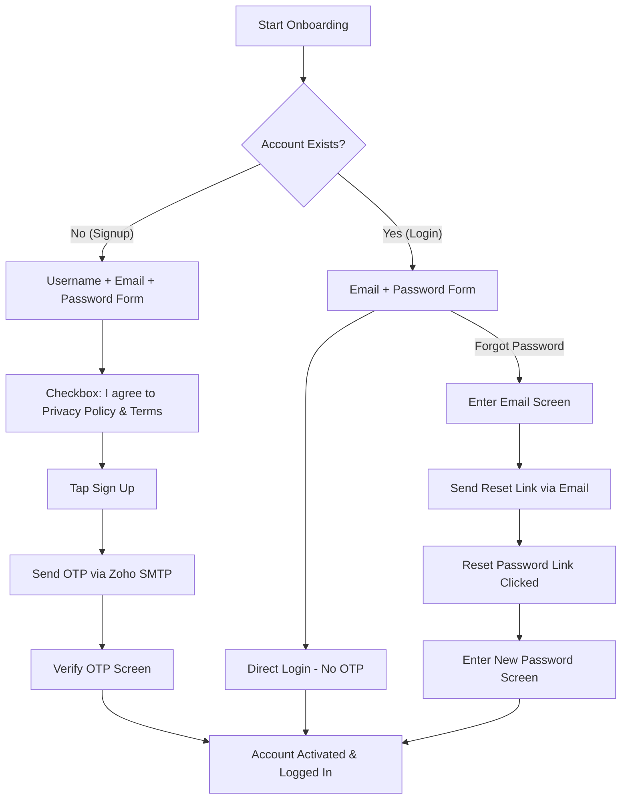

# 📋 Client Enhancements & Auth System Refactoring: Implementation Plan

This document provides a comprehensive analysis and detailed implementation plan for refactoring the authentication and email systems in the **I Like It** application. It serves as a blueprint for the next development stage.

---

## 🔍 1. Current System Audit (How It Works Today)

Based on our analysis of the Flutter frontend (`i_like_it`) and Supabase backend (`project-backend`):

*   **Custom Session Management:** The app currently bypasses standard Supabase GoTrue Auth for user sessions. Instead, it relies on client-generated UUIDs stored locally in `FlutterSecureStorage` via `UserSessionManager`.
*   **Database Lookup:** The login/registration flow uses a custom PostgreSQL RPC `get_user_id_by_email` which searches a custom `public.users` table.
*   **Custom OTP Mechanism:** OTP code requests insert rows into a custom table `public.email_otps`. A database trigger (`on_auth_otp_request`) fires a webhook hitting a Supabase Edge Function (`v1/send-otp`).
*   **Edge Function SMTP:** The Deno Edge Function (`send-otp`) uses `nodemailer` via SMTP to send emails. It currently has a fallback to `smtp.zoho.in` using hardcoded credentials (`support@ilikeit.co.in` / `owner_srk@5781`).
*   **RLS Policy Discrepancy:** The PostgreSQL schema has Row-Level Security (RLS) enabled on `users`, `folders`, and `links` using `auth.uid() = id`. Since the client currently bypasses standard Supabase Auth, `auth.uid()` remains `NULL`, meaning any strict RLS policies would fail on the public/anon API level unless RLS is manually disabled in the Supabase Dashboard.

---

## 🛠️ 2. Detailed Feature Implementation Plan

We need to implement a secure, compliant, and frictionless authentication flow based on the client's spreadsheet requirements.



### 1. Signup / Registration Flow
*   **UI Fields:**
    *   `Username` (New text input field)
    *   `Email Address` (Standard email input)
    *   `Password` (New secure text entry field with visibility toggle)
*   **Compliance Checkbox:**
    *   A mandatory checkbox: *"I agree to the Privacy Policy and Terms of Use"*.
    *   **Behavior:** Unchecked by default; the "Sign Up" button remains disabled (greyed out) until checked.
*   **State Preservation & Hyperlinks:**
    *   Links for *"Privacy Policy"* and *"Terms of Use"* will open in the device's default web browser using the `url_launcher` package.
    *   **State Preservation:** We will implement state persistence inside the form's `StatefulWidget` so that when the user switches apps to read the policies and returns, their typed username, email, and password remain intact in the text controllers.
*   **Verification:**
    *   Sends a verification email with a 6-digit OTP code to the email address.
    *   Redirects to a one-time "Verify OTP" screen. Once verified, the account status becomes activated/verified, and the session starts.

### 2. Login Flow
*   **UI Fields:**
    *   `Email Address`
    *   `Password`
*   **Behavior:**
    *   Direct authentication. If credentials match, the user logs in immediately and goes to the dashboard.
    *   **No OTP code is requested or sent on subsequent logins**, drastically reducing user friction.

### 3. Forgot Password / Reset Flow
*   **UI Flow:**
    *   Add a *"Forgot Password?"* text button on the login screen.
    *   Redirects to a screen asking for the user's `Email Address`.
    *   Sends an email containing a secure password reset link.
*   **Reset Mechanism Options (Requires Client Decision):**
    *   **Option A (In-App Reset via Deep Link):** Tapping the email link opens the app via a custom scheme (`ilikeit://reset-password?token=XYZ`). The app intercepts this, shows an in-app "Reset Password" screen, and updates the password.
    *   **Option B (External Web Reset Page):** Tapping the link opens a browser webpage hosted on Supabase or the client's domain. The user resets their password on the web page and is then directed to return to the app to log in.

### 4. Welcome Email
*   **Behavior:**
    *   Triggered automatically once the user verifies their email (finishes the signup flow).
    *   Contains introductory branding, app features, and a helpful welcome message.

---

## 🏗️ 3. Proposed Architecture Approaches

We recommend migrating the backend to standard Supabase Auth to ensure robust security, session tokens, and compliance.

### Approach A: Standard Supabase Auth (Recommended)
*   **How it works:** We use `supabase.auth.signUp(...)` and `supabase.auth.signInWithPassword(...)`.
*   **Database Integration:** When a user is created in Supabase Auth, the trigger `on_auth_user_created` automatically inserts their details into `public.users`. We will update the schema to copy the custom `username` field from metadata.
*   **Email & SMTP:** We configure Zoho SMTP settings directly in the Supabase Dashboard. All verification, reset, and authentication emails are sent automatically by Supabase via Zoho SMTP.
*   **Pros:**
    *   **Security:** Passwords are hashed and stored securely by Supabase (cryptographic industry standards).
    *   **Session Management:** Automates JWT generation, expiration, and secure renewal.
    *   **RLS Alignment:** Automatically resolves database row permissions via `auth.uid() = id`.
*   **Cons:** Requires access to the Supabase Dashboard to paste HTML templates and configure SMTP credentials.

### Approach B: Custom Database-Based Auth (Current System Extension)
*   **How it works:** We add `password_hash` (using PostgreSQL `pgcrypto` crypt/bf extensions) and `username` columns directly to `public.users`.
*   **Email & SMTP:** We continue using Supabase Edge Functions (`send-otp`, `send-reset`, `send-welcome`) which connect to Zoho SMTP and send custom HTML.
*   **Pros:** Entirely code-controlled; does not require Supabase dashboard config.
*   **Cons:** High security risk. Harder to securely maintain session tokens and prevent API spoofing on the client. Breaks built-in RLS policies.

> [!IMPORTANT]
> **We strongly recommend Approach A (Standard Supabase Auth)**. It provides industry-grade security out of the box and aligns with the database Row Level Security (RLS) policies already defined in `schema.sql`.

---

## 📋 4. Client Deliverables & Action Items

To successfully implement this refactoring in the next stage, we require the following from the client (**Shreeyash**):

### ✅ Already Completed by Client (No Action Required)
*   [x] Zoho Mail Business Setup configured.
*   [x] Connected custom domain `ilikeit.co.in` via GoDaddy.
*   [x] Official support email `support@ilikeit.co.in` created.
*   [x] DNS records (SPF, DKIM, DMARC) verified in Zoho and GoDaddy.

### 📥 Required from Client (Action Items)

| Resource Needed | Description / Purpose | Status |
| :--- | :--- | :--- |
| **Zoho SMTP Password** | The password or App Password for `support@ilikeit.co.in` to allow the backend code/Supabase console to authenticate with Zoho Mail. | ⏳ Pending |
| **Verification Email HTML** | The custom HTML template for the verification/OTP email (`Verify your email - ILikeIt`). | ⏳ Pending |
| **Reset Password Email HTML** | The custom HTML template for the forgot password email (`Reset your password - ILikeIt`). | ⏳ Pending |
| **Welcome Email HTML** | The custom HTML template for the welcome email sent after registration. | ⏳ Pending |
| **Privacy Policy & Terms URLs** | The external web links for the Privacy Policy and Terms of Use (to launch in external browser). | ⏳ Pending |
| **Forgot Password Option Choice** | Decision on whether to use **Option A (In-app reset screen via deep link)** or **Option B (External web reset page)**. | ⏳ Pending |
| **App Logo URL** | A public image URL of the official app logo to embed inside the email templates. | ⏳ Pending |

---

## 🗺️ 5. Technical Implementation Steps (Next Stage)

Once the resources are received, the development team will execute the following steps:

### Backend (Supabase / Database)
1.  **Schema Update:**
    ```sql
    -- Add username and verification status to users table
    ALTER TABLE public.users ADD COLUMN IF NOT EXISTS username text;
    ALTER TABLE public.users ADD COLUMN IF NOT EXISTS is_verified boolean DEFAULT false;

    -- Update handle_new_user trigger to save username
    CREATE OR REPLACE FUNCTION public.handle_new_user() 
    RETURNS trigger AS $$
    BEGIN
      INSERT INTO public.users (id, email, username)
      VALUES (new.id, new.email, COALESCE(new.raw_user_meta_data->>'username', ''));
      RETURN new;
    END;
    $$ LANGUAGE plpgsql SECURITY DEFINER;
    ```
2.  **SMTP Configuration:** Enter Zoho Mail SMTP host `smtp.zoho.in`, port `465`, secure auth, username, and password into Supabase Dashboard settings (or Edge Function secrets).
3.  **HTML Templates Integration:** Upload/paste custom HTML templates into Supabase Email templates (or Edge Functions code).

### Frontend (Flutter)
1.  **Dependency Verification:** Ensure `url_launcher` is integrated.
2.  **Deep Link Setup (If Option A chosen):**
    *   **Android:** Add intent filters to `AndroidManifest.xml` under `<activity>`.
    *   **iOS:** Add custom URL schemes to `ios/Runner/Info.plist`.
3.  **Refactor `InitialSetupScreen` UI & Logic:**
    *   Construct standard input forms (username, email, password, legal checkbox).
    *   Manage controller focus and view state to avoid losing field inputs on context switches.
    *   Wire up Supabase Auth endpoints for signup, verification, direct login, and password recovery.
4.  **Create Password Reset Screen:**
    *   Add a custom password update form for handling deep links in the app.
